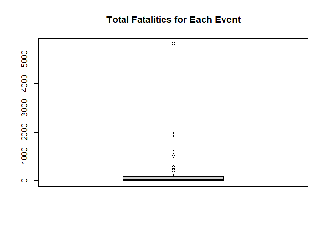
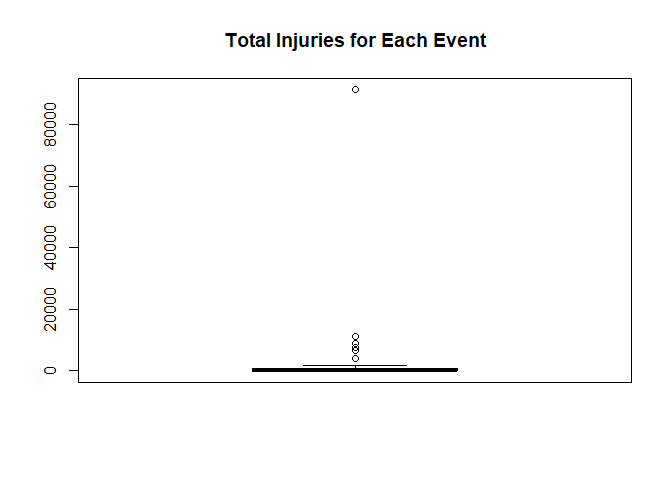
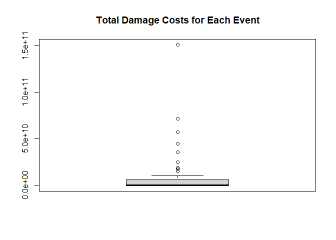

## Synopsis
This is a course project that takes data from the U.S. National Oceanic and Atmospheric Administration's (NOAA) storm database which we will use to determine which event is the most harmful to population health and which event has the most economic consequences. The data which this report ranges from 1950 to November 2011 and focuses on includes the event type, the number of fatalities/injuries with the specific event, and the property/crop damage caused by the specific event. For this report, the event type is "cleaned" of typos by matching what is in the database to what the proper event names are. Then, the property and crop damages are added to each other to get the total damage cost for the specific event. Lastly, the total fatalities, injuries, and damage costs are calculated for each event type. Fatalities and Injuries are used as analogs to find which event is most harmful to population health while the total damage costs are used to find which event has the most economic impact.

## Data Processing
The data comes from the (NOAA) storm database. The event information comes with typos and so the library "stringdist" is use to find the closest match from the the misspelled event to the the correct event name. Also, the data is reduced to only contain what is used for analysis.  

```r
# load required library
library(stringdist)
```

```
## Warning: package 'stringdist' was built under R version 4.0.3
```

```r
#data download
url<-"https://d396qusza40orc.cloudfront.net/repdata%2Fdata%2FStormData.csv.bz2"
download.file(url,"DataFile_Proj2.csv.bz2")
data<-read.csv("DataFile_Proj2.csv.bz2",header=TRUE)

event_type<-read.csv("Event Types.csv",header=FALSE) # csv file containinng the full and correct event names becuase original data has typos
# The even names came from the pg.6 of the pdf at https://d396qusza40orc.cloudfront.net/repdata%2Fpeer2_doc%2Fpd01016005curr.pdf 
# viewed on 3/5/2021 at 7 PM EST.
event_type[,1]<-NULL
names(event_type)<-"Event"

# Subset data to keep only what is needed for analysis
data2<-subset(data,select=c(EVTYPE,FATALITIES:CROPDMGEXP))

# Match the events from the data with correct names to account for typos
data2$Event<-amatch(data2$EVTYPE,event_type$Event,maxDist=50)
data2$Event<-event_type$Event[data2$Event]
```


For property and crop damage, the exponent/magnitude is converted from a character to the corresponding numeric value. The property and crop damages are then added to each other to get the total damage cost for the specific event.  

```r
# Convert the damage exponnents to all 10^x to later calculate the property and crop damage
data2$PROPDMGEXP[tolower(data2$PROPDMGEXP)=="k"]<-3
data2$PROPDMGEXP[tolower(data2$PROPDMGEXP)=="h"]<-2
data2$PROPDMGEXP[tolower(data2$PROPDMGEXP)=="m"]<-6
data2$PROPDMGEXP[tolower(data2$PROPDMGEXP)=="b"]<-9
data2$PROPDMGEXP[tolower(data2$PROPDMGEXP)==""]<-0
data2$PROPDMGEXP[tolower(data2$PROPDMGEXP)=="+"]<-0
data2$PROPDMGEXP[tolower(data2$PROPDMGEXP)=="?"]<-0
data2$PROPDMGEXP[tolower(data2$PROPDMGEXP)=="-"]<-0
data2$PROPDMGEXP<-as.numeric(data2$PROPDMGEXP)
data2$Property<-data2$PROPDMG*(10^data2$PROPDMGEXP) # Calculate property damage

data2$CROPDMGEXP[tolower(data2$CROPDMGEXP)=="k"]<-3
data2$CROPDMGEXP[tolower(data2$CROPDMGEXP)=="m"]<-6
data2$CROPDMGEXP[tolower(data2$CROPDMGEXP)=="b"]<-9
data2$CROPDMGEXP[tolower(data2$CROPDMGEXP)==""]<-0
data2$CROPDMGEXP[tolower(data2$CROPDMGEXP)=="?"]<-0
data2$CROPDMGEXP<-as.numeric(data2$CROPDMGEXP)
data2$Crop<-data2$CROPDMG*(10^data2$CROPDMGEXP) # Calculate crop damage

data2$DamageCost<-data2$Property+data2$Crop # Total damage cost (propert+crop)
```

## Results

The first question we answer is "What events across the US are most harmful to with respect to population health?". To do this, the number of fatalities and injuries are each aggregated by the event type.

```r
fatalities<-aggregate(data2$FATALITIES,by=list(event=data2$Event),FUN=sum)
fatalities$event[which(fatalities$x==max(fatalities$x))]
```

```
## [1] "Tornado"
```

```r
boxplot(fatalities$x,main="Total Fatalities for Each Event")
```

<!-- -->

```r
summary(fatalities$x)
```

```
##    Min. 1st Qu.  Median    Mean 3rd Qu.    Max. 
##     0.0     2.0    33.0   336.6   169.0  5633.0
```

```r
injuries<-aggregate(data2$INJURIES,by=list(event=data2$Event),FUN=sum)
injuries$event[which(injuries$x==max(injuries$x))]
```

```
## [1] "Tornado"
```

```r
boxplot(injuries$x,main="Total Injuries for Each Event")
```

<!-- -->

```r
summary(injuries$x)
```

```
##    Min. 1st Qu.  Median    Mean 3rd Qu.    Max. 
##       0       2      70    3123     792   91346
```
From the information provide we see that Tornadoes are responsible for the most fatalities and injuries with 5633 and 91346, respectively. Hence,Tornadoes are most harmful to population health.  


Similar to fatalities and injuries, the total damage costs are aggregated for each event type.  


```r
damage_costs<-aggregate(data2$DamageCost,by=list(event=data2$Event),FUN=sum)
damage_costs$event[which(damage_costs$x==max(damage_costs$x))]
```

```
## [1] "Flood"
```

```r
boxplot(damage_costs$x,main="Total Damage Costs for Each Event")
```

<!-- -->

```r
summary(damage_costs$x)
```

```
##      Min.   1st Qu.    Median      Mean   3rd Qu.      Max. 
## 0.000e+00 7.596e+06 1.462e+08 1.061e+10 5.918e+09 1.511e+11
```
From the data, we see that Flood's caused the greatest economic impact costing 151.1 billion dollars.


