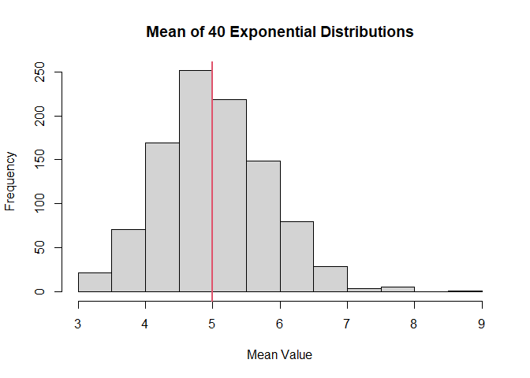
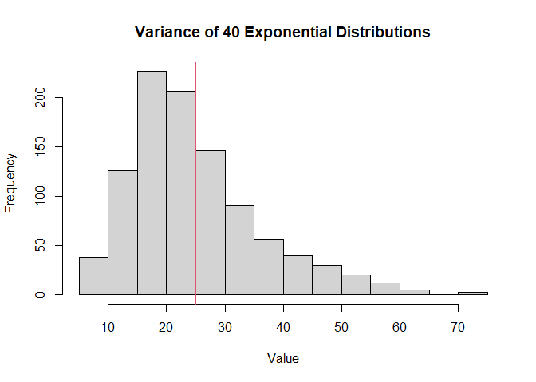
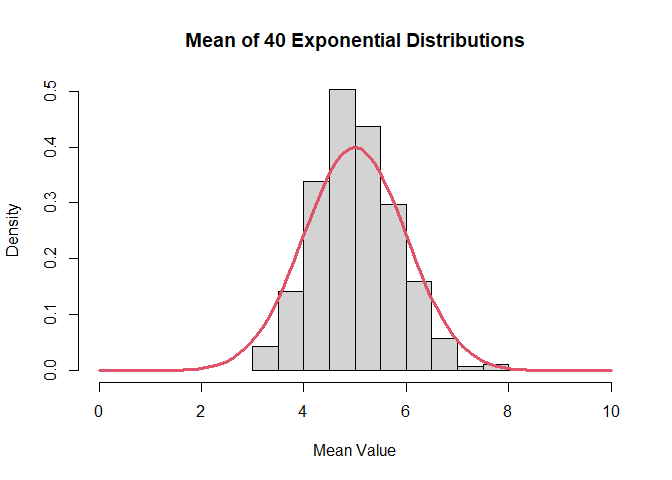

## Overview
This report consists of a simulation exercise as well as basic inferential data analysis. An exponential distribution is simulated, and the distribution of the averages of 40 exponentials is observed and compared to a normal distribution. Then, basic statistical analysis on the ToothGrowth data set to see if guinea pig tooth length differs based on dose and delivery method of Vitamin C.

# Part 1: Simulation Exercise

## Simulations

For this exercise we will run 1000 simulations of 40 exponential distributions (each). The rate of the exponentials (i.e. lambda) is set to 0.2.


```r
lambda<-0.2

mns = {NULL}
vrs = {NULL}
for (i in 1:1000) {
      mns = c(mns,mean(rexp(40,lambda)))
      vrs = c(vrs,var(rexp(40,lambda)))
}
```


## Sample Mean versus Theoretical Mean
For the exponential distributions with a rate = lambda = 0.2 the theoretical mean is 1/lambda.


```r
mean_theor<-1/lambda
mean_sample<-mean(mns)
mean_sample
```

```
## [1] 5.02294
```

```r
mean_theor
```

```
## [1] 5
```

We can see that the the sample mean is pretty close to the theoretical mean.


```r
hist(mns,main="Mean of 40 Exponential Distributions",xlab="Mean Value")
abline(v=mean_theor,col=2,lwd=2)
```

<!-- -->

In the plot above, we see a histogram of the 1000 means of the 40 exponential distributions. The theoretical mean is displayed as a vertical red line. We can see that the most common mean value of 40 exponentials is approximately 5.

## Sample Variance versus Theoretical Variance

For the exponential distributions with a rate = lambda = 0.2 the theoretical standard deviation is 1/lambda. The variance is equivalent to the square of the standard deviation. Thus the theoretical variance is equal to 25 = 5^2.  


```r
sd_theor<-1/lambda
var_sample<-mean(vrs)
var_theor<-sd_theor^2
var_sample
```

```
## [1] 25.02817
```

```r
var_theor
```

```
## [1] 25
```

We can see that the sample variance is in close agreement to the theoretical variance of 25.


```r
hist(vrs,main="Variance of 40 Exponential Distributions",xlab="Value")
abline(v=var_theor,col=2,lwd=2)
```

<!-- -->

In the plot above, we see a histogram of the 1000 variances of the 40 exponential distributions. The theoretical variance is displayed as a vertical red line. We can see that the most common variance value of 40 exponentials is approximately 25.


## Distribution
Below is the density histogram of the 1000 means of 40 exponentials. Overlayed in red is a normal distribution curve.  

```r
hist(mns,freq = FALSE,xlim=c(0,10),main="Mean of 40 Exponential Distributions",xlab="Mean Value")
curve(dnorm(x,mean=mean_theor,sd=1),add=TRUE,col=2,lwd=3)
```

<!-- -->

We can see that the distribution of the means is approximately normal. The histogram of the mean values as approximately the same shape as a normal distribution curve centered at the theoretical mean.


# Part 2: Basic Inferential Data Analysis Exercise
We will use the Tooth Growth data set in R. It contains the tooth length of guinea pigs who were given varying doses of Vitamin C through two methods of administration (Orange Juice or Ascorbic Acid).

```r
data<-ToothGrowth #load and save data
summary(data)
```

```
##       len        supp         dose      
##  Min.   : 4.20   OJ:30   Min.   :0.500  
##  1st Qu.:13.07   VC:30   1st Qu.:0.500  
##  Median :19.25           Median :1.000  
##  Mean   :18.81           Mean   :1.167  
##  3rd Qu.:25.27           3rd Qu.:2.000  
##  Max.   :33.90           Max.   :2.000
```

```r
unique(data$dose)
```

```
## [1] 0.5 1.0 2.0
```

From the data summary we see that the tooth length varies from 4.2 to 33.9 with a median of 19.25 and a mean of 18.81. In addition we see that there are 30 values each of tooth lengths for Vitamin C administered by Orange Juice (OJ) and Ascorbic Acid (Vitamin C, VC). In addition we see that the dose is either 0.5, 1.0, or 2.0 mg/day. 


Below is code to isolate length by the Vitamin C delivery method and by the dosage.


```r
# isolate length by Vitamin C delivery method
OJ<-data$len[data$supp=="OJ"] #Orange Juice
VC<-data$len[data$supp=="VC"] # Ascorbic Acid

# isolate length by Vitamin C dosage [mg/day]
dose_05<-data$len[data$dose==0.5] 
dose_10<-data$len[data$dose==1.0]
dose_20<-data$len[data$dose==2.0]
```

First, we will do hypothesis testing via a t-test to see if the toot length differs based on the Vitamin C delivery method (supp).

```r
t.test(OJ,VC,paired=FALSE,alternative = "two.sided")
```

```
## 
## 	Welch Two Sample t-test
## 
## data:  OJ and VC
## t = 1.9153, df = 55.309, p-value = 0.06063
## alternative hypothesis: true difference in means is not equal to 0
## 95 percent confidence interval:
##  -0.1710156  7.5710156
## sample estimates:
## mean of x mean of y 
##  20.66333  16.96333
```

From the t-test we got a p-value of 0.06 which is greater than 0.05. Hence, Tooth Growth was not significantly dependent on the delivery method of Vitamin C.


There are three different doses. Since we did not cover ANOVAs in the class I will do 3 t-tests and perform a p-value correction to see if there is a significant difference.
The threshold for significance is equivalent to alpha = 0.05/3 = 0.0167.

First we will do a comparison of a dose of 0.5 mg/day compared to 2.0 mg/day.

```r
t.test(dose_05,dose_20,paired=FALSE,alternative = "two.sided")
```

```
## 
## 	Welch Two Sample t-test
## 
## data:  dose_05 and dose_20
## t = -11.799, df = 36.883, p-value = 4.398e-14
## alternative hypothesis: true difference in means is not equal to 0
## 95 percent confidence interval:
##  -18.15617 -12.83383
## sample estimates:
## mean of x mean of y 
##    10.605    26.100
```

We can see that tooth length is significantly dependent on the dosage of Vitamin C of 0.5 compared to 2.0 mg/day.

Next, we will compare a dose of 0.5 mg/day compared to 1.0 mg/day.

```r
t.test(dose_05,dose_10,paired=FALSE,alternative = "two.sided")
```

```
## 
## 	Welch Two Sample t-test
## 
## data:  dose_05 and dose_10
## t = -6.4766, df = 37.986, p-value = 1.268e-07
## alternative hypothesis: true difference in means is not equal to 0
## 95 percent confidence interval:
##  -11.983781  -6.276219
## sample estimates:
## mean of x mean of y 
##    10.605    19.735
```

Again, we see that the tooth length for a 0.5 mg/day dose is significantly different from that of a 1.0 mg/day dose.

Lastly, we will compare a dose of 1.0 mg/day compared to 2.0 mg/day.

```r
t.test(dose_10,dose_20,paired=FALSE,alternative = "two.sided")
```

```
## 
## 	Welch Two Sample t-test
## 
## data:  dose_10 and dose_20
## t = -4.9005, df = 37.101, p-value = 1.906e-05
## alternative hypothesis: true difference in means is not equal to 0
## 95 percent confidence interval:
##  -8.996481 -3.733519
## sample estimates:
## mean of x mean of y 
##    19.735    26.100
```
Once again, we see that the tooth length was significantly different for Vitamin C doses of 1.0 compared to 2.0 mg/day.

Especially since we saw a significant difference between all comparisons of 0.5, 1.0, and 2.0 mg/day with the adjusted p-value threshold we can come to the conclusion that tooth length is significantly dependent on the dosage of Vitamin C.
