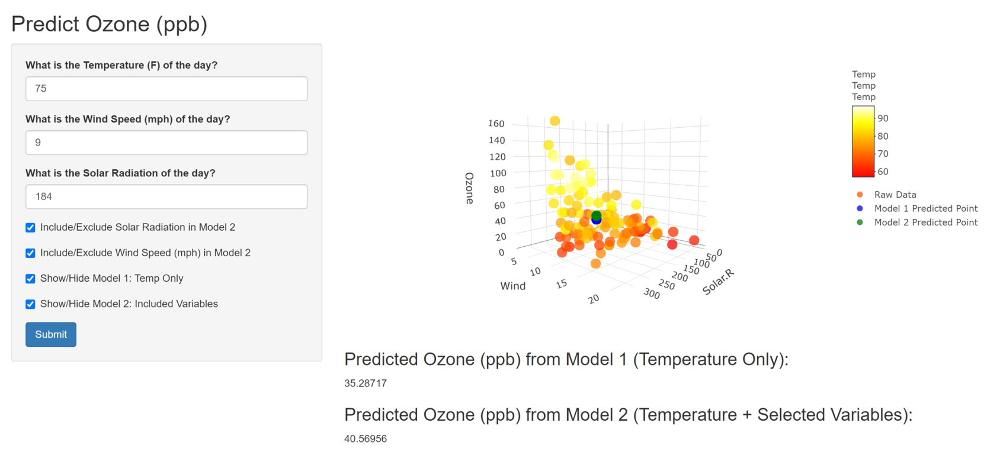

## Air Quality

-The shiny app utilizes the "airquality" dataset in r that has the daily air quality measurements for New York from May 1973 to September 1973.  
  
-The user can predict the Ozone (ppb) with inputs of temperature, wind speed, and solar radiation level.  

-There are 2 models to predict Ozone, both a linear models

-The default model, **Model 1**, uses only temperature.  

-In addition, the user can select wether to add wind speed and/or solar radiation level to improve predictive capabilities.   

-**Model2** is depened on what variables the user selects to include.


## The App
This is what the app looks like.  

{#id .class width=100% height=100%}


## The Data
```{r,message=FALSE}
library(plotly)
data<-airquality[complete.cases(airquality),1:4]
plot_ly(data,x=~Solar.R,y=~Wind,z=~Ozone,color=~Temp,colors=heat.colors(50),type="scatter3d",mode="markers",opacity = 0.75,name="Raw Data")
```

## Conclusion
This provides a useful tool to:
      - Predict Ozone from temperature, wind speed, and solar radiation
      - Determine which variables to include in the model
      
The app also plots the inputted and predicted points to visualize how well it agrees with the data


Thank you
